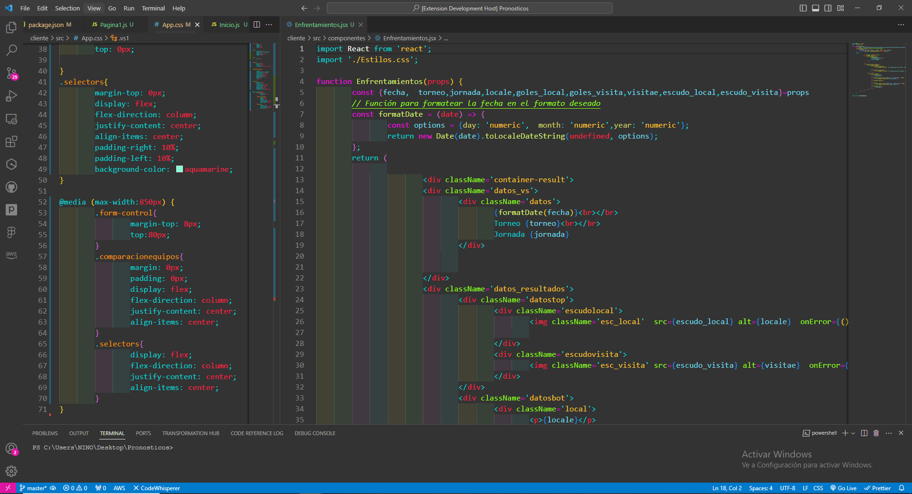
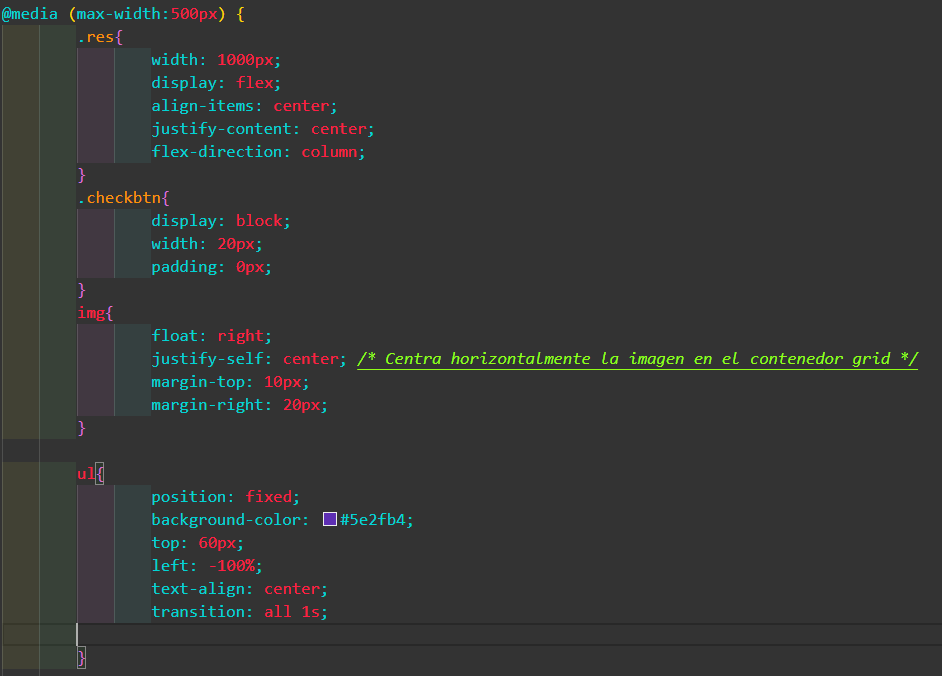
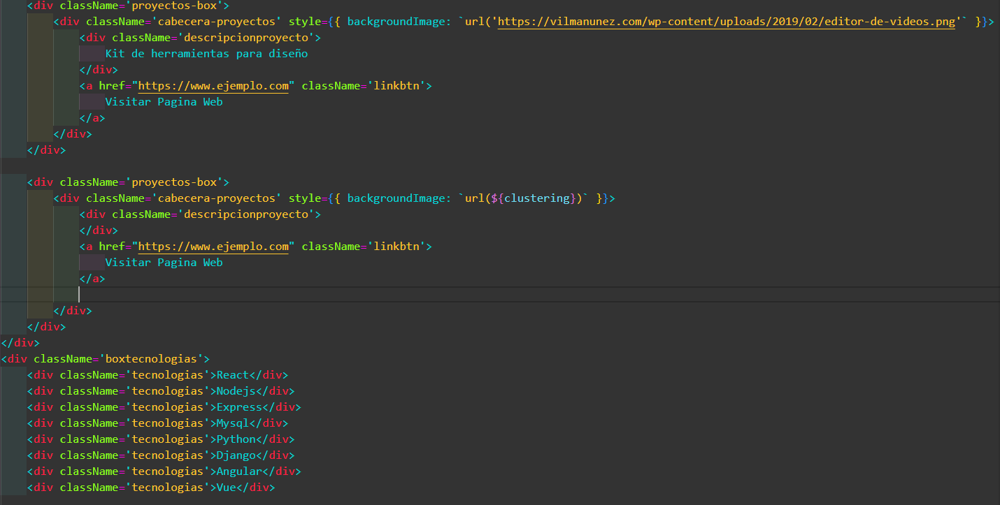
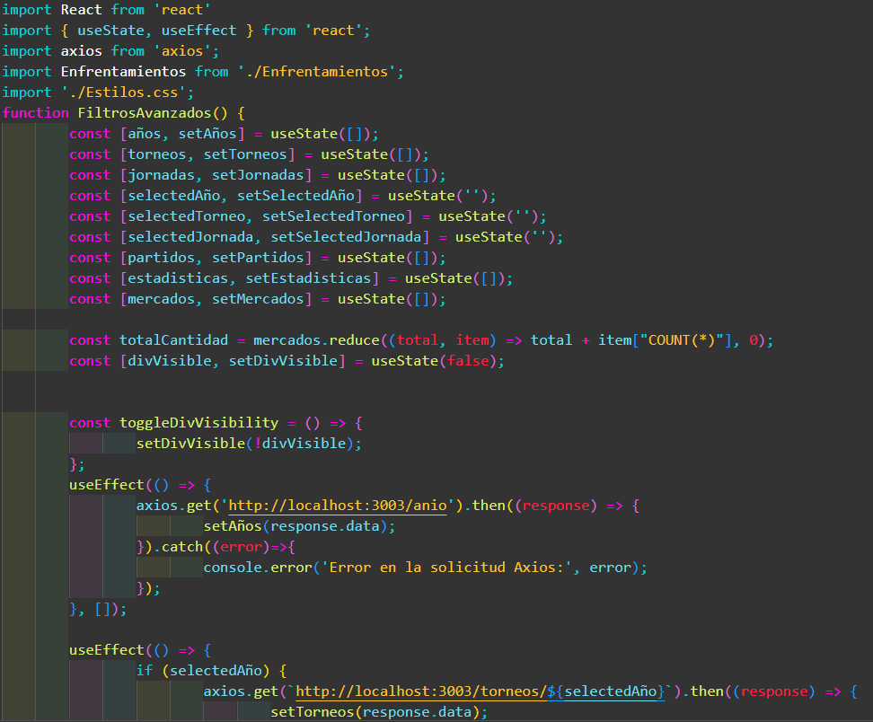
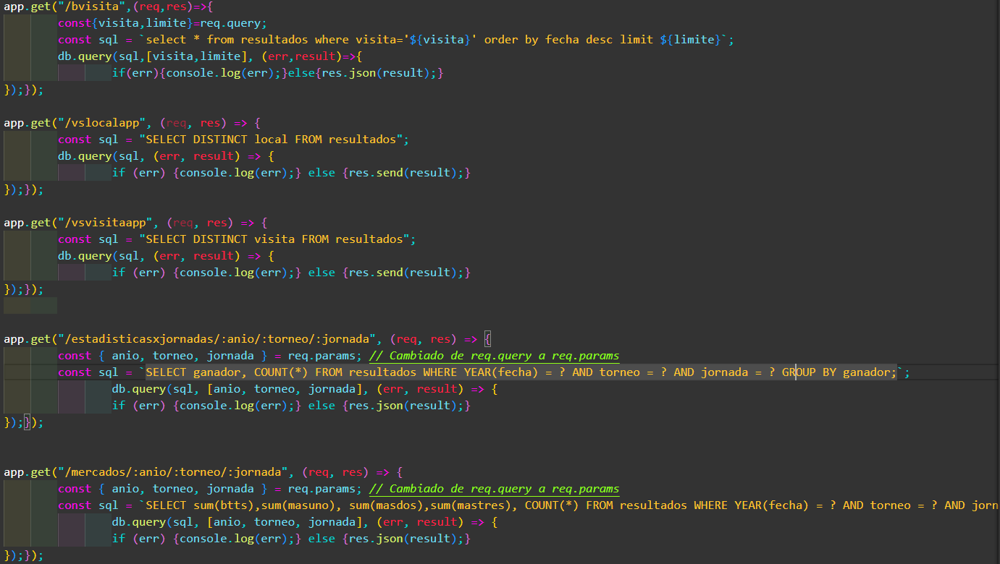

## EXTENSION DINAMICA

Explora nuestros temas diseñados con contrastes de colores y fondos recomendados para brindar una experiencia visual agradable, evitando la fatiga ocular durante las extensas sesiones de programación. Cuida de tus ojos mientras trabajas con nuestros diseños que buscan optimizar la legibilidad y minimizar el esfuerzo visual."

## GENERAL

## CSS

## HTML

## REACT

## NODEJS

## Instalación

Puedes instalar este tema directamente desde Visual Studio Code:

1. Ve a "Extensiones" (Ctrl+Shift+X).
2. Busca "theme-extensions".
3. Haz clic en "Instalar".
4. Selecciona tu tema activo en las preferencias de Visual Studio Code.

©Nino Barrios